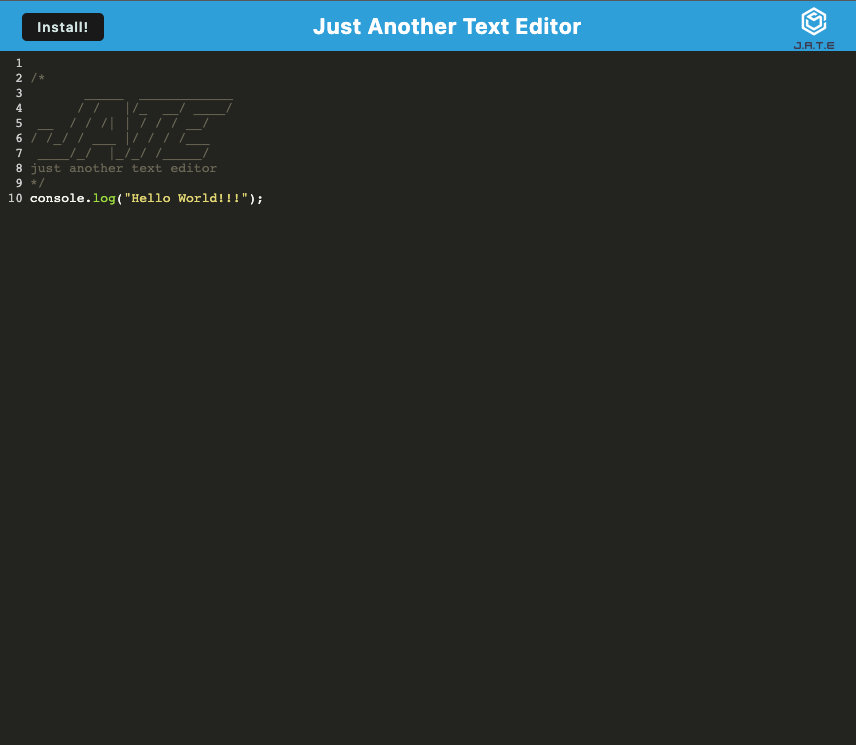

# Notes Application

## Licence
[](https://opensource.org/licenses/MIT)

## Description

This is a text editor web application that allows developers to create and save notes or code snippets with or without an internet connection. This means that you can use the application even when you are not connected to the internet and still be able to retrieve your notes or code snippets for later use.

## Link to deployed application on Heroku

[Link to application](https://coding-boot-camp.github.io/full-stack/heroku/heroku-deployment-guide).

## Usage

Once the application is running, you can open it in your browser and start using it. The application is built with webpack and uses next-gen JavaScript, but it still functions in the browser without errors.

When you open the text editor, an IndexedDB database storage is immediately created. This means that any content you enter and subsequently click off of the DOM window will be saved with IndexedDB. When you reopen the text editor after closing it, the content in the text editor will be retrieved from IndexedDB.

You can also click on the Install button to download the web application as an icon on your desktop. When you load the web application, you should have a registered service worker using workbox. This means that your static assets will be pre-cached upon loading, along with subsequent pages and static assets.

## User Story

```md
AS A developer
I WANT to create notes or code snippets with or without an internet connection
SO THAT I can reliably retrieve them for later use
```

## Acceptance Criteria

```md
GIVEN a text editor web application
WHEN I open my application in my editor
THEN I should see a client server folder structure
WHEN I run `npm run start` from the root directory
THEN I find that my application should start up the backend and serve the client
WHEN I run the text editor application from my terminal
THEN I find that my JavaScript files have been bundled using webpack
WHEN I run my webpack plugins
THEN I find that I have a generated HTML file, service worker, and a manifest file
WHEN I use next-gen JavaScript in my application
THEN I find that the text editor still functions in the browser without errors
WHEN I open the text editor
THEN I find that IndexedDB has immediately created a database storage
WHEN I enter content and subsequently click off of the DOM window
THEN I find that the content in the text editor has been saved with IndexedDB
WHEN I reopen the text editor after closing it
THEN I find that the content in the text editor has been retrieved from our IndexedDB
WHEN I click on the Install button
THEN I download my web application as an icon on my desktop
WHEN I load my web application
THEN I should have a registered service worker using workbox
WHEN I register a service worker
THEN I should have my static assets pre cached upon loading along with subsequent pages and static assets
WHEN I deploy to Heroku
THEN I should have proper build scripts for a webpack application
```

## Installation

To run the application, follow these steps:

1. > Clone the repository to your local machine.
2. > Open the terminal and navigate to the root directory of the project.
3. > Run `npm run install` to install the necessary dependencies.
4. > Run `npm run start` to start the application. This will start up the backend and serve the client.

## Screenshot




## Contributing

Contributing
Contributions are welcome! If you would like to contribute to this project, please fork the repository and submit a pull request.

## Support

- [MDN](https://developer.mozilla.org/en-US/) 

- [Google](https://Google.com)


## Questions

If you have any questions about this project, please feel free to reach out to me:
  
- [Contact - Full Stack Coder - Iaroslav Lasiichuk](mailto:lasiichuki@gmail.com)
